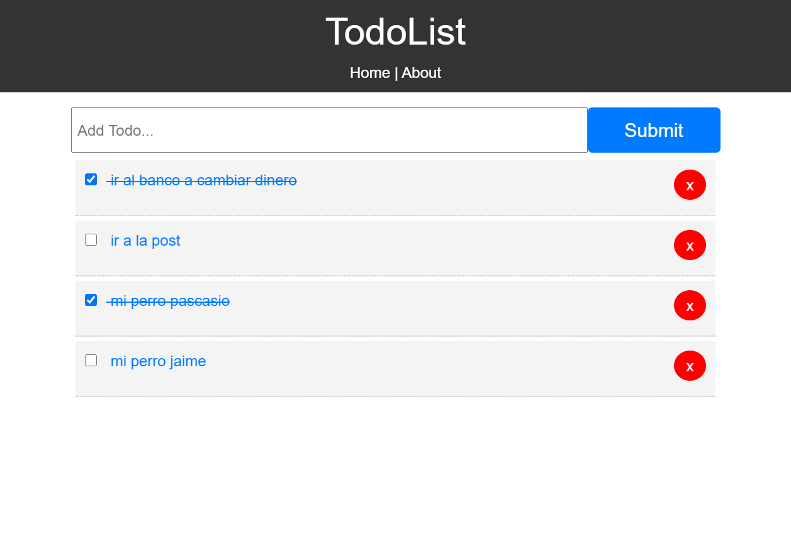

# TodoApp

* This project was generated with [Angular CLI](https://github.com/angular/angular-cli) version 10.0.0.
* we'll need to prepare a JSON REST API that we can consume using HttpClient.
** https://www.npmjs.com/package/json-server
## Running json-server
Run `npm run server`

## Development server

Run `ng serve` for a dev server. Navigate to `http://localhost:4200/`. The app will automatically reload if you change any of the source files.
